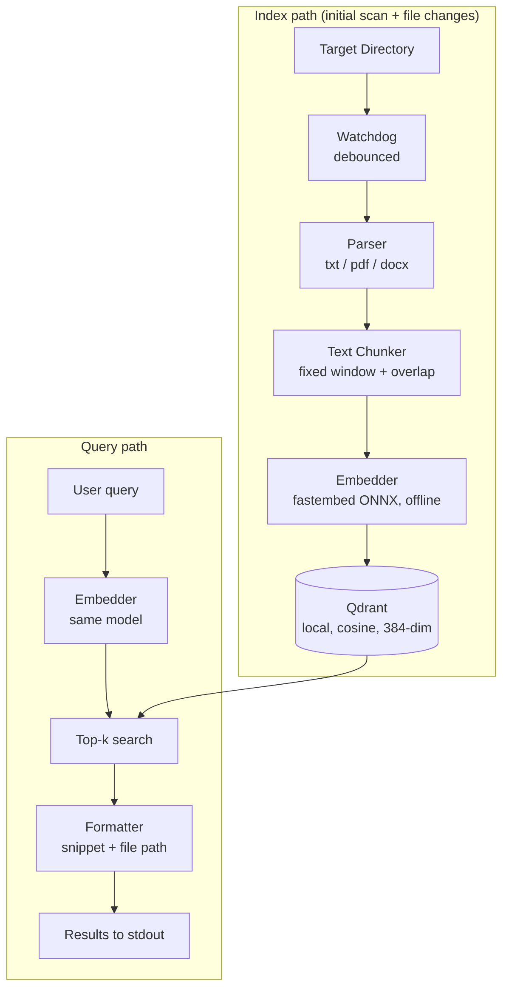

# QorFinder

Local-first semantic search CLI. Two jobs: index a user-chosen directory into a local vector DB (Qdrant), and answer queries as top-k matching chunks with file references.

FYP1 report: [here](https://docs.google.com/document/d/1CtL0q7dBs9l-KT-bIHI4P1I4dvECrhdV/edit?usp=sharing&ouid=100227885797542500700&rtpof=true&sd=true)

## MVP architecture



- Everything runs locally: no cloud APIs, no API keys
- Same embedding model on both paths (`intfloat/multilingual-e5-small`, 384 dims) — changing it means re-indexing
- Each Qdrant point stores: file path, chunk index, raw text

## Quick start

```powershell
# 1. Start Qdrant (gRPC on 6334, REST on 6333)
docker run -d -p 6333:6333 -p 6334:6334 -v qorfinder_data:/qdrant/storage qdrant/qdrant

# 2. Build (Windows, MSVC toolchain)
cargo build --release

# 3. Index a directory (--once skips watching)
.\target\release\qorfinder.exe index C:\path\to\docs
.\target\release\qorfinder.exe index C:\path\to\docs --once

# 4. Query
.\target\release\qorfinder.exe query "what does the text say about zakat" -k 5
```

- First run downloads the ONNX embedding model (~120 MB) into `~/.cache/qorfinder/models`; afterwards everything works offline
- Supported file types: `txt`, `md`, `markdown`, `pdf`, `docx`
- Evaluation and benchmarking: `eval` subcommand (nDCG/Recall/MRR against qrels) plus scripts in `scripts/`; see `docs/PROGRESS.md` for corpora, measured results, and roadmap

## Configuration (env vars or flags)

| Env var                 | Flag              | Default                  |
|-------------------------|-------------------|--------------------------|
| `QORFINDER_QDRANT_URL`  | `--qdrant`        | `http://localhost:6334`  |
| `QORFINDER_COLLECTION`  | `--collection`    | `qorfinder`              |
| `QORFINDER_MODEL_CACHE` | `--model-cache`   | `~/.cache/qorfinder/models` |

## Dependencies

| Crate            | Purpose                                    |
|------------------|--------------------------------------------|
| `clap`           | CLI argument parsing                       |
| `notify`         | file watching (debounced)                  |
| `lopdf`          | PDF text extraction                        |
| `docx-rs`        | DOCX text extraction                       |
| `fastembed`      | local ONNX sentence embeddings             |
| `qdrant-client`  | Qdrant gRPC client (upsert/delete/search)  |
| `tokio`          | async runtime                              |
| `walkdir`        | directory traversal                        |
| `uuid`           | deterministic point IDs                    |

## Development

- Repo lives on a WSL mount but targets Windows — build/test via the Windows shell:
  `powershell.exe -Command "Set-Location C:\Users\khory\Desktop\QorFinder; cargo test --lib"`
- `cargo test --lib` runs the offline unit tests (parser, chunker, formatter); no Qdrant or model needed
- CI (`.github/workflows/ci.yml`) runs `fmt --check`, `clippy -D warnings`, `cargo test --lib`, `cargo build --release` on Ubuntu and Windows
