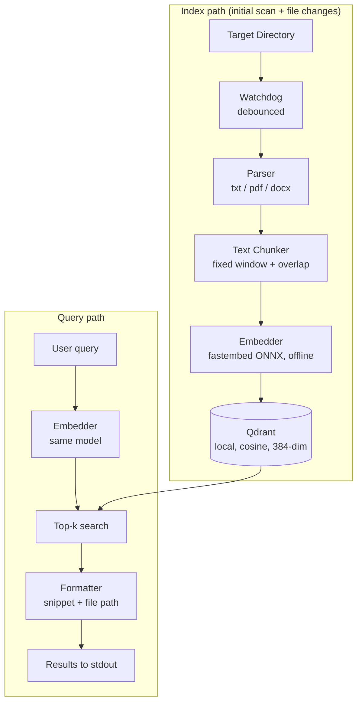

# QorFinder

Local-first semantic search CLI. Two jobs: index a user-chosen directory into a local vector DB, and answer queries as top-k matching chunks with file references.

FYP1 report: [here](https://docs.google.com/document/d/1CtL0q7dBs9l-KT-bIHI4P1I4dvECrhdV/edit?usp=sharing&ouid=100227885797542500700&rtpof=true&sd=true)

## MVP architecture

- Everything runs locally: no cloud APIs, no API keys
- Same embedding model on both paths — changing it means re-indexing
- Each Qdrant point stores: file path, chunk index, raw text
